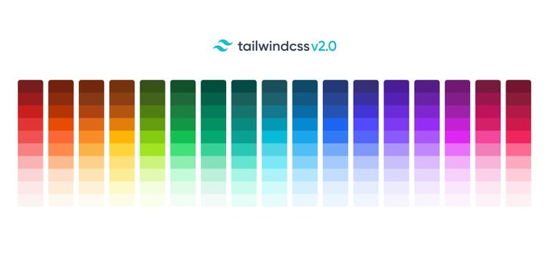

# What's new in TailwindCss 2.0

Tailwind Css frameworks keeps moving fast and many of the features for v2 are already known. The upgrade looks like it will be easy with a few breaking changes. As the release will probably come in November, we'll try to update the post as new features are announced.

You can start using most of the new features, as they are already deployed in 1.8 behind feature flags.

## Remove deprecated gap utilities

Since v1.7.0, you had available `gap-x-{n}` and `gap-y-{n}` making `col-gap-{n}` and `row-gap-{n}` redundant.

To enable the flag and use the 2.0 behavior, you can use `removeDeprecatedGapUtilities` flag on your project's `tailwind.config.js`:

```js
module.exports = {
  future: {
    removeDeprecatedGapUtilities: true,
  },
}
```

## Purge layers by default

The current behavior of the included purgecss only works on the `@utilities` block (it represents the major part of the total build size). In 2.0, it purges utilities from `base`, `components` and `utilities`, so you can expect a smaller build size.

To use the new behavior, add to your `tailwind.config.js` the following snippet:

```js
module.exports = {
  future: {
    purgeLayersByDefault: true,
  },
}
```

You can also [configure the layers to be purged](https://tailwindcss.com/docs/upcoming-changes#purge-layers-by-default).

## Default line heights for font size utilities

In the v1.0, font-size utilities didn't comes with default line heights but in v2.0 all font-size utilities like `text-md` and `text-xl` will include their own default line-height value.

```js
// Default config for 2.0

module.exports = {
  // ...
  theme: {
    fontSize: {
      xs: ['0.75rem', { lineHeight: '1rem' }],
      sm: ['0.875rem', { lineHeight: '1.25rem' }],
      base: ['1rem', { lineHeight: '1.5rem' }],
      lg: ['1.125rem', { lineHeight: '1.75rem' }],
      xl: ['1.25rem', { lineHeight: '1.75rem' }],
      '2xl': ['1.5rem', { lineHeight: '2rem' }],
      '3xl': ['1.875rem', { lineHeight: '2.25rem' }],
      '4xl': ['2.25rem', { lineHeight: '2.5rem' }],
      '5xl': ['3rem', { lineHeight: '1' }],
      '6xl': ['4rem', { lineHeight: '1' }],
    },
  },
}
```

This change will break your design if you didn't using spcific line-height like `leading-8` with your font-size classes, the easiest to fix this problem you have to look through your project for any places where you are using a font-size utility and add `leading-normal` to work like old behavior.

To use new font-size utilities you can add `defaultLineHeights` flag to your config.

```js
module.exports = {
  future: {
    defaultLineHeights: true,
  },
  // ...
}
```

## Rename font-thin and font-hairline

In v2.0, the `font-thin` utility will be renamed to `font-extralight` and `font-hairline` will be renamed to `font-thin`.

To start using the new font-weight utilities names you can add `standardFontWeights` flag to your config.

```js
module.exports = {
  future: {
    standardFontWeights: true,
  },
  // ...
}
```

## Drop IE 11 support

In v2.0 the Internet Explorer 11 support will be removed, as Adam Wathan said `Going to drop it for 2.0, you can continue to use 1.x (which is the best CSS framework currently available on earth) if you need IE 11 support.`


## New Color Scheme

[Steve Schoger](https://twitter.com/steveschoger) is working on a new color palette that expands the current one, but it isn't available yet, so you have to wait until 2.0 release to try it.


